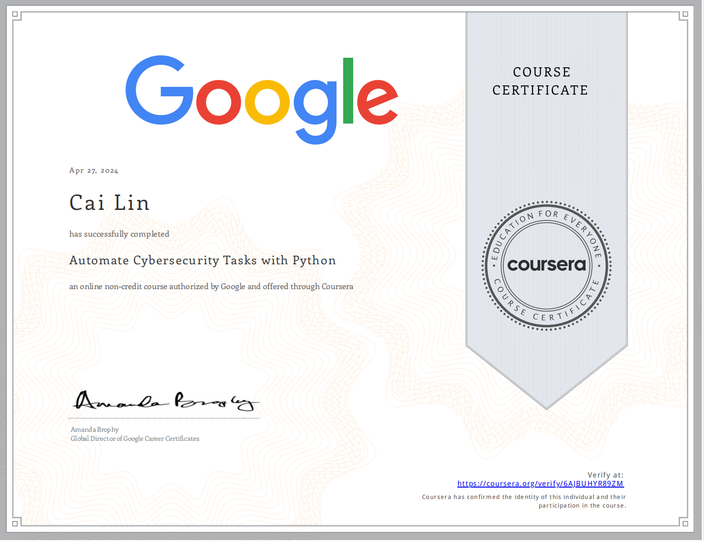

# Automate-Cybersecurity-Tasks-with-Python

## Module 1: Introduction to Python

## Module 2: Write effective Python code

## Module 3: Work with strings and lists

## Module 4: Python in practice  

 

# Proof of Completion

